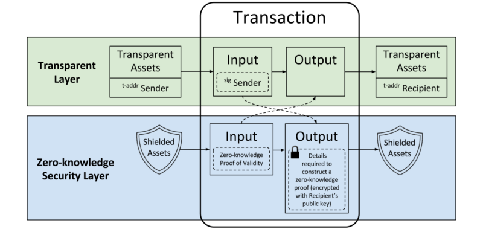

# Zero Knowledge Introduction

## Index:
[Glossary](#glossary)
[What are Zero Knowledge Proofs](#what-are-zero-knowledge-proofs)
[How ZKPs Work](#how-zkps-work)
[Other variations of ZK proofs]()
* [ZK-SNARKs]()
* [ZK-STARKs]()

[Resources](#resources)

## Glossary

Like with anything cool, you need to know how to speak the lingo before you can understand the concepts. 

**Parties involved in a ZK proof**
* **Prover:** The party trying to prove what they are claiming is true. i.e Trying to prove that they are over 18 (without revealing there age). 
* **Verifier:** The party trying to verify the information is true. i.e The bar making sure that all their customers are over 18 years of age. 

**Terms describing ZK proofs**
* **Data Exchange:** Revealing partial data that the prover wants to reveal/prove to the verifier. i.e Proving that you are over 18, without revealing your date of birth. 
* **Completeness:** If the information is true and both the prover and the verifier follow the same protocol, the verifier must be convinced of the truth of the information. 
* **Soundness:** If the information is false, the verifier must be convinced the information is incorrect. 
* **Zero-knowledge:** If the statement is true, the verifier learns nothing of the information other than the fact that its true. 
* **Interactive:** Multiple messages must occur between the verifier and prover before the verifier can be convinced of validity. 
* **Non-interactive:** Less interactions are required between the verifier and prover before the verifier is convinced. 

**ZK Protocols**
* **ZKP:** Zero Knowledge Proofs. Proving data is true without revealing the information. Interactive. A ZKP can be a data exchange: i.e The prover proving they are over 18 without revealing their date of birth, in such a way that the verifier is satisfied with the proof. Or it can simply proof that you know information without revealing anything about that information. i.e proving you know the password to a safe without revealing the password at all. 
* **ZK-SNARK:** A zero knowledge proof that is non-interactive. SNARK stands for:
    * **Succinct:** The proof can be verified quickly (including large statements).
    * **Non-interactive:** Described above.
    * **Argument of Knowledge:** A computationally sound proof
        > Soundness holds against the prover that leverages polynomial-time, i.e bounded computation.

## What are Zero Knowledge Proofs

Zero Knowledge Proofs allow parties to prove the validity of information without revealing the underlying information. All Zero Knowledge proofs need to meet 3 criteria before it is considered a ZKP, completeness, soundness and Zero-knowledge. These ensures that if both parties follow the protocol, the information provided by the prover will be revealed as true or false without the verifier discovering the information.  

## How ZKPs Work

ZK Proofs work on two layers. The transparent layer, and the security layer. The security layer never sees the underlying information. 

## Other variations of ZK proofs

## Resources 
[Introduction to Zero Knowledge Proof: The protocol of next generation Blockchain](https://medium.com/coinmonks/introduction-to-zero-knowledge-proof-the-protocol-of-next-generation-blockchain-305b2fc7f8e5)
[The future of blockchain privacy: zero-knowledge proofs in decentralised exchanges](https://hackernoon.com/the-future-of-blockchain-privacy-zero-knowledge-proofs-in-decentralised-exchanges-7a0c1c5ea6a1)

